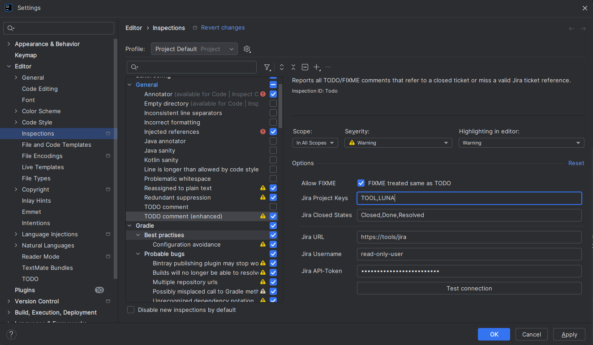

# Idea TODO Inspection Plugin

[![JetBrains Plugins][jetbrains-plugin-release-shield]][jetbrains-plugin]
![Plugin Downloads][jetbrains-plugin-download-shield]

![Project Maintenance][maintenance-shield]
[![License][license-shield]][license]

[![Build Status][build-status-shield]][build-status]
[![Deploy Status][deploy-status-shield]][deploy-status]

## 💡 Overview

<!-- Plugin description -->
The `TODO Inspection Plugin` is an IntelliJ IDEA plugin designed to enhance the standard TODO inspection mechanism by
integrating with a Jira ticketing system.

It solves a common problem where developers leave `TODO` comments in the code referencing tickets, only for those
tickets to be closed later, leaving the technical debt forgotten. This plugin ensures that your `TODO`s are always
relevant and actionable by surfacing warnings when a linked ticket is already complete.
<!-- Plugin description end -->

## ✨ Features

This plugin provides real-time feedback by marking `TODO` or `FIXME` comments in the editor if:

* No Jira ticket is referenced.
* The referenced Jira ticket does not exist.
* The referenced Jira ticket is already in a closed state.
* Jira is not accessible due to configuration issues or system unavailability.

The following code locations are scanned for `TODO` or `FIXME` comments:

<table>
  <thead>
    <tr>
      <th>Location</th>
      <th>Filetypes</th>
    </tr>
  </thead>
  <tbody>
    <tr>
      <td>Single line comments</td>
      <td>any</td>
    </tr>
    <tr>
      <td>Multiline comments</td>
      <td>any</td>
    </tr>
    <tr>
      <td>Doc comments (e.g., Javadoc in Java)</td>
      <td>any</td>
    </tr>
    <tr>
      <td>JUnit-Jupiter <code>@Disabled</code> annotations</td>
      <td>Java</td>
    </tr>
  </tbody>
</table>

### Examples

<table>
  <thead>
    <tr>
      <th>Code Comment</th>
      <th>Status in JIRA</th>
      <th>Plugin Behavior</th>
    </tr>
  </thead>
  <tbody>
    <tr>
      <td><code>// TODO PROJECT-123 Fix race condition</code></td>
      <td>In Progress</td>
      <td>No Warning</td>
    </tr>
    <tr>
      <td><code>// TODO PROJECT-123 Fix race condition</code></td>
      <td>Closed</td>
      <td>Warning: <code>TODO references a ticket which is already done</code></td>
    </tr>
    <tr>
      <td><code>// TODO PROJECT-1239999 Fix race condition</code></td>
      <td>n/a</td>
      <td>Warning:  <code>TODO references a ticket that does not exist</code></td>
    </tr>
    <tr>
      <td><code>// TODO Update API</code></td>
      <td>n/a</td>
      <td>Warning: <code>TODO does not reference a ticket</code></td>
    </tr>
  </tbody>
</table>

### ⬇️ Installation

- **Using IDE built-in plugin system:**
  <kbd>Settings/Preferences</kbd> > <kbd>Plugins</kbd> > <kbd>Marketplace</kbd> > <kbd>Search for "Todo Inspection"</kbd> >
  <kbd>Install Plugin</kbd>

- **Manually:**
  Download the [latest release][latest-release] and install it manually using
  <kbd>Settings</kbd> > <kbd>Plugins</kbd> > <kbd>⚙</kbd> > <kbd>Install plugin from disk...</kbd>

### 🛠️ Configuration

Configure the plugin under <kbd>Settings</kbd> > <kbd>Editor</kbd> > <kbd>Inspections</kbd> > <kbd>General</kbd> > <kbd>TODO comment (enhanced)</kbd>.

The following settings are available:

| Setting            | Description                                                                                                          | Default Value        |
|--------------------|----------------------------------------------------------------------------------------------------------------------|----------------------|
| Allow FIXME        | If unchecked, all `FIXME`s are marked as a warning. Otherwise, `FIXME`s are handled the same way as `TODO`s.         | `unchecked`          |
| Jira Project Keys  | Comma separated list of Jira project-keys used to find ticket-IDs in the TODO comments.                              |                      |
| Jira Closed States | Comma separated list of ticket status to consider as closed.                                                         | Closed,Done,Resolved |
| Jira URL           | The Jira base-url which can be used to query the Jira API.                                                           |                      |
| Jira Username      | Username for a Jira user account to be used to query the Jira API (requires only read access to your Jira projects). |                      |
| Jira API-Token     | API token or password for the configured Jira user account.                                                          |                      |

### 🏆 Credits

* [SIX Group](https://github.com/six-group): For the code-camp 2025 (where this plugin was initially developed).
* [rcs80](https://github.com/rsc80): For the `todo-report-maven-plugin` which delivered the idea to have an inspection for `TODO`s directly in IntelliJ IDEA.

[license-shield]: https://img.shields.io/github/license/frimtec/idea-todo-inspection-plugin.svg
[license]: https://opensource.org/licenses/Apache-2.0
[maintenance-shield]: https://img.shields.io/maintenance/yes/2025.svg
[build-status-shield]: https://github.com/frimtec/idea-todo-inspection-plugin/workflows/Build/badge.svg
[build-status]: https://github.com/frimtec/idea-todo-inspection-plugin/actions?query=workflow%3ABuild
[deploy-status-shield]: https://github.com/frimtec/idea-todo-inspection-plugin/actions/workflows/release.yml/badge.svg
[deploy-status]: https://github.com/frimtec/idea-todo-inspection-plugin/actions/workflows/release.yml
[jetbrains-plugin-release-shield]: https://img.shields.io/jetbrains/plugin/v/28829
[jetbrains-plugin-download-shield]: https://img.shields.io/jetbrains/plugin/d/28829
[jetbrains-plugin]: https://plugins.jetbrains.com/plugin/28829-todo-inspection
[latest-release]: https://github.com/frimtec/idea-todo-inspection-plugin/releases/latest
